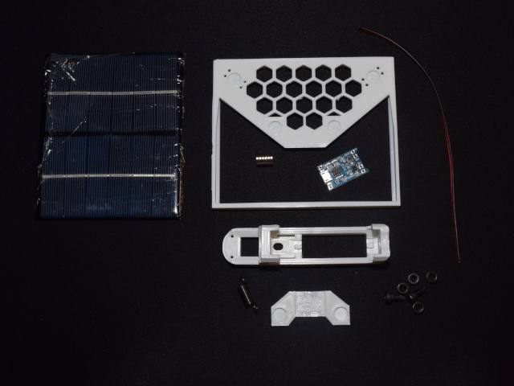

# 18650 Solar Charger 

Housing for light duty solar panel. Includes integrated charger and magnetic connectors to attach 18650 Li-Ion and output leads.  

## Parts List

| Part | Image | 
| --- | --- |
| [6V solar panel 200ma](https://www.amazon.com/uxcell-200mA-Solar-Module-Charger/dp/B073Y8P7R9) |  |
| [18650 Battery](https://www.amazon.com/HAKADI-2000mAh-Rechargeable-PackEnergy-Discharge/dp/B09C5XDJF6/) |  |
| [TP4056](https://www.amazon.com/Mudder-Pieces-Charging-Battery-Protection/dp/B087Q915LF/) |  |
| [Spring](https://www.homedepot.com/p/Everbilt-Spring-Assortment-Kit-84-Pack-13554/203133714) |  |
| [8mm x 2mm Magnets](https://www.amazon.com/FINDMAG-Multi-Use-Refrigerator-Whiteboard-Neodymium/dp/B09BB1VT4J/) |  | 
| M3 Hardware | 2x M3x12   4x M3 Nut | 
| Super Glue |  | 

## Print Settings 
Print the solar panel case with no supports to ensure the instalation channel is smooth. PETG also might be the best choice due to UV resistence.   

### Files 

  * [Frame Only](./files/frame_only.stl) 
  * [Panel Case](./files/panel_case.stl)
  * [TP4506 Cover](./files/tp4506_cover.stl)
  * [Battery Housing](./files/batt_housing.stl)

## Assemble
This section details how to assmeble the unit. 

### Panel Holder
1. Print and gather the required parts  

  

2. Glue the magnets in place paying attention to the polarity of the magnets  
    * With the exception of the location circled in red orient the polarity of all magnets the same way. This will ensure the battery is always affixed with the correct polarity as well.  

  

3. Strip about 3 inches of wire and lightly tin with solder. 
    * Keep the wire flat in the middle. This will help maximize the contact area while minimizing the distance between magnets.  
  
  **DO NOT SOLDER ON THE MAGNET. HEAT WILL MAKE THE MAGNET VERY WEAK**

  

4. Pass the wire through holes and over the magnet twice as shown
      * Hook the end of the wire arouind the beginning of the loop to keep everything in place

  |  |  |
  | --- | --- |

5. Insert the solar panel from the back

  |  |  |
  | --- | --- |

6. Tin some other sections of wire and affix them to the panel as shown 

  

7. Place the TP4056 in position and solder everything in place
    * Be sure to place the Bat+ and Bat- on the corrct terminals 

8. Create two other short leads, tin them, and affix to the Out+ and Out- as shown. 
    * Again being sure to keep the wire flat where it overlaps the magnet

  **DO NOT SOLDER ON THE MAGNET. HEAT WILL MAKE THE MAGNET VERY WEAK**
  
  

### Battery Holder

1. Glue the magnets in place, 
    * Be sure to match the polarity of the magnets with the corresponding magnets on the panel

2. Screw the bolts and nuts into the holder 

3. Tin some sections of wire 

4. Feed these through the holes so the wire passes over the magnets as shown
    * Be sure to keep the wire flat where it passes over the magnet 

  

5. Loop the wire around the bold and add another nut to lock everything together

  

## Use 

1. Add battery 

  

2. Affix holder to panel 
  
  

3. Add light or USB

  

4. Route the wires under the cover to quickly attach output wires 

  

