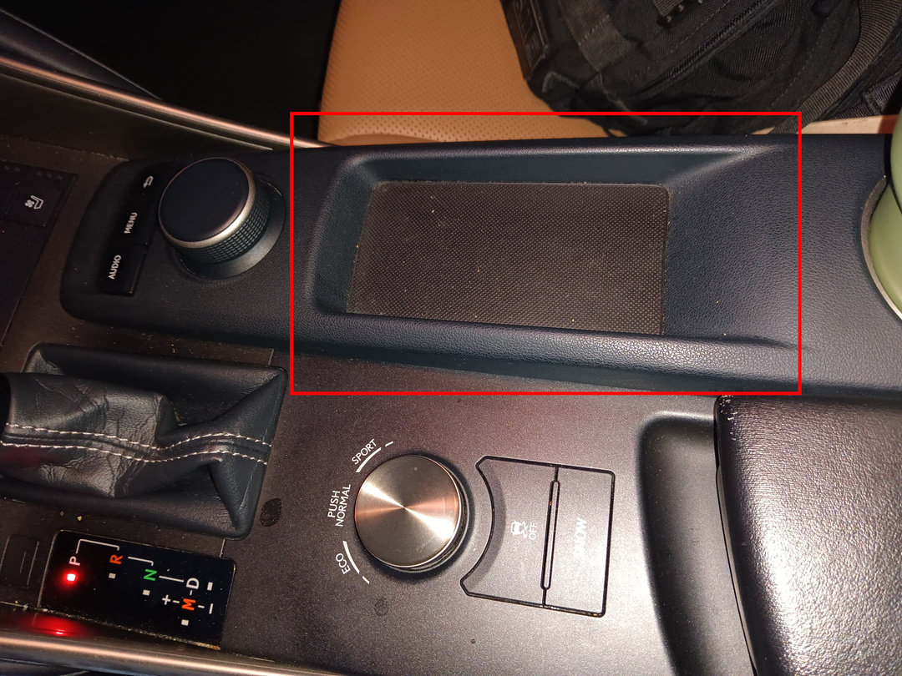
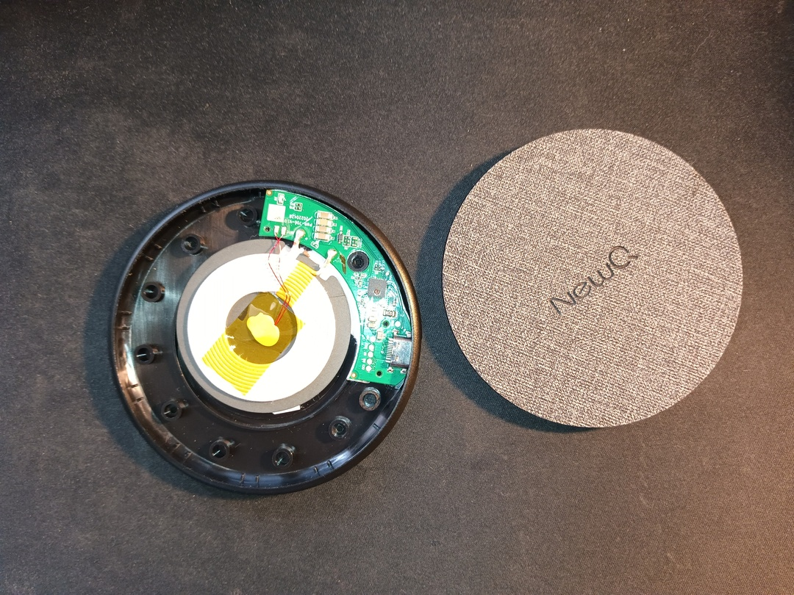
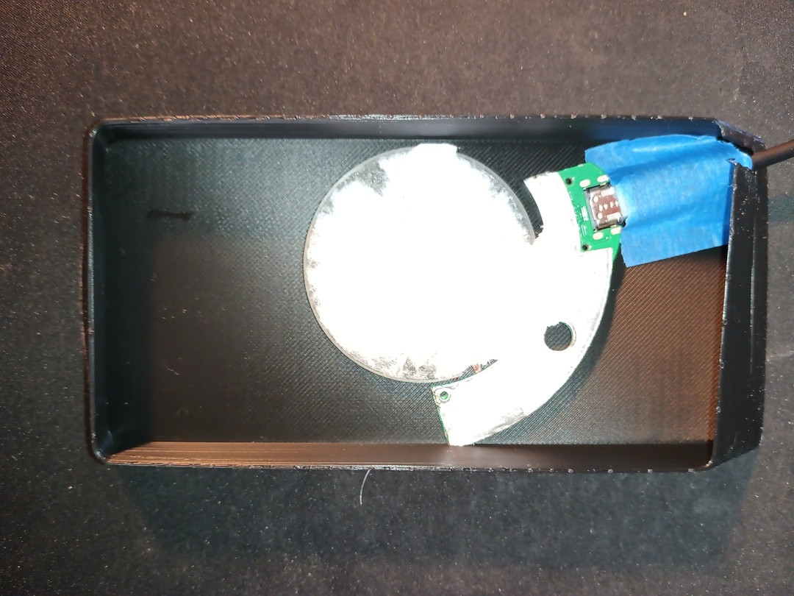
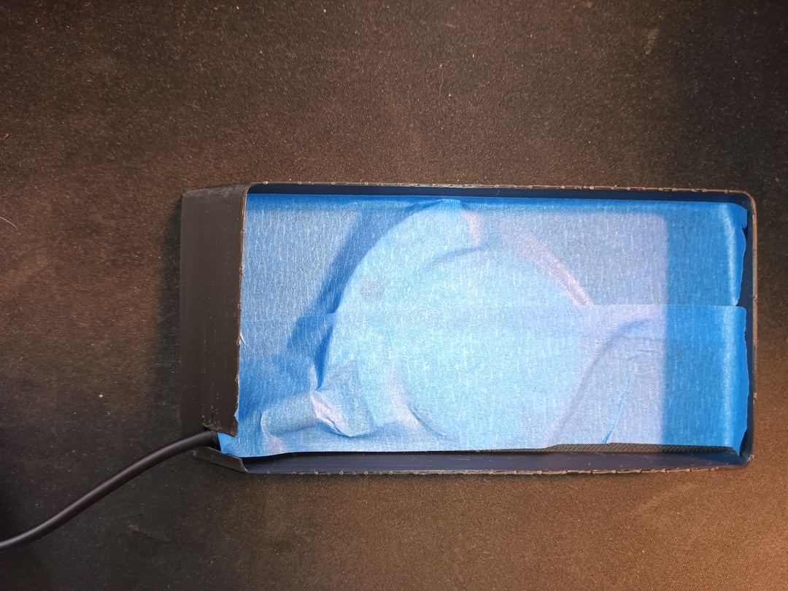

# IS300 Inductive Charger Upgrade

The dealer keeps giving me fancy loaners with cool features like inductive chargers in hopes of selling me a new car. 

Checkmate dealer.

## Parts List

* IS with this thing  
* [Inductive charger](https://www.amazon.com/NewQ-Wireless-Charger-Charging-Compatible/dp/B0B2NLWG1Q)
* Housing [housing](files/housing.stl) file 
* 12v to 5v USB C style charger (recommended, more power)
* No slip tape (recommended)

## Print

I used ABS because it's too hot for PLA in a car where I live.

## Post Print 

1. Disassemble charger 
2. Place  
3. Affix  
4. Add no slip tape and install   
