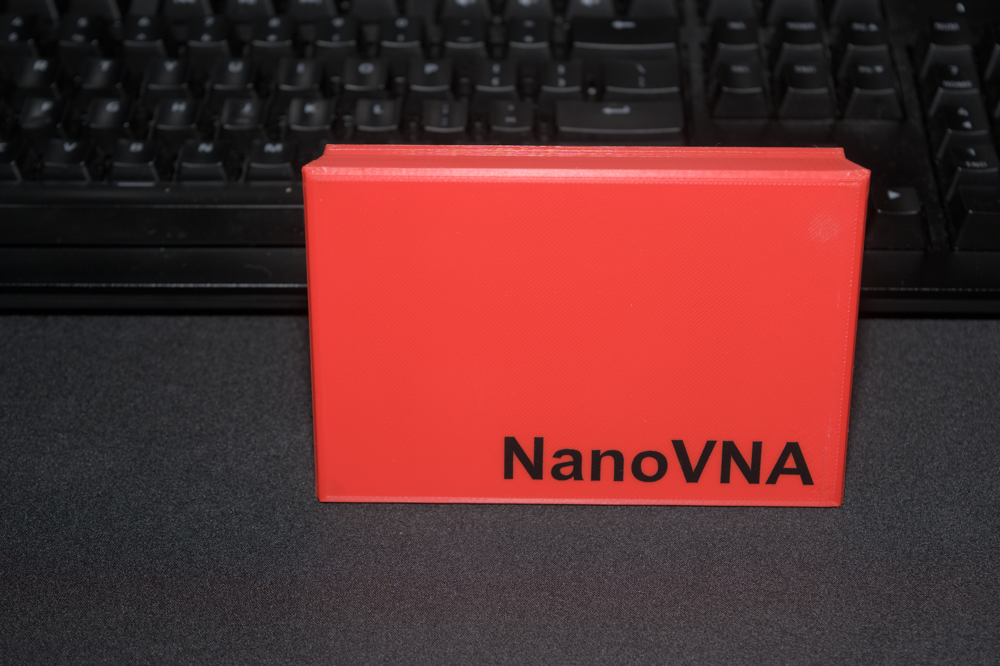
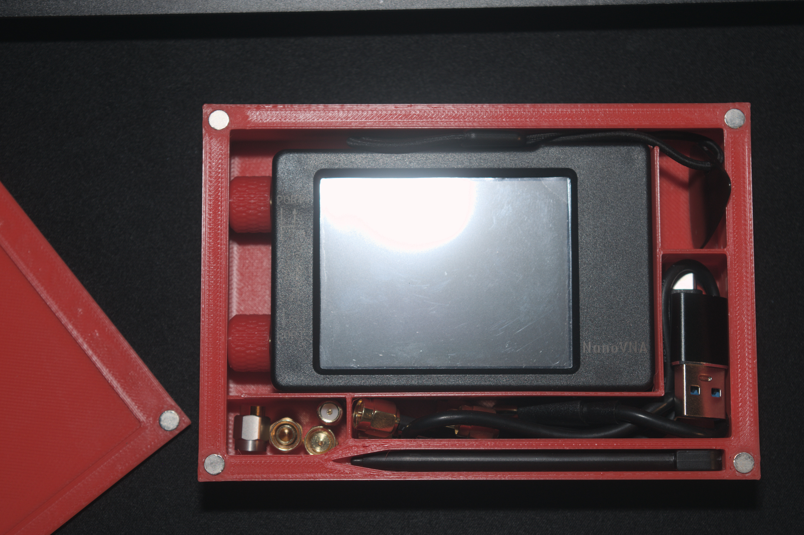
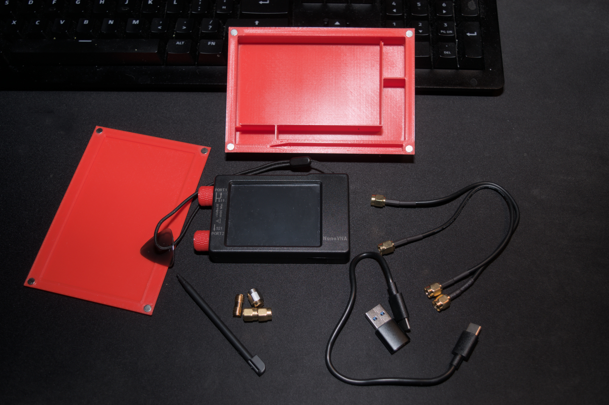

# 3D Print NanoVNA
3D printable case for the a NanoVNA with magnetically secured lid. 

 

Holds everything shown. 

|  |  | 
| --- | --- |

## Print and assemble 
Any material, no supports, & 5x2 magnets 

## Files

  * [lid](files/top.stl) 
  * [bottom](files/bottom.stl)

*cameo appearance: [Emoticon Fury SMA caps](https://www.printables.com/model/784000-threaded-sma-connector-knurled-caps-fpv-drones-hac)*

