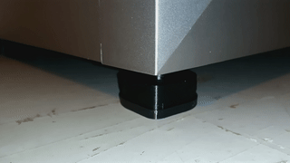
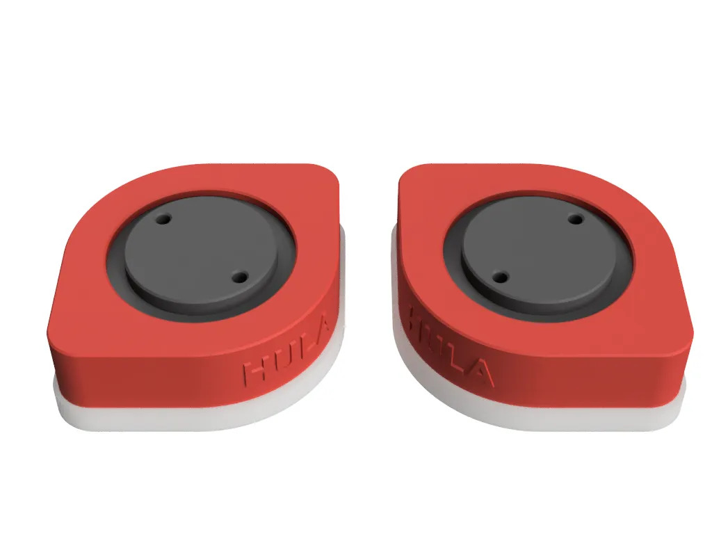

# HULA Unimount Adapter
Qidi Plus 4 adapter for the [Hula anti vibration mounts](https://makerworld.com/en/models/417509#profileId-502144). 

This adapter works with the stock Plus 4 feet and the Unicore inserts. 

 

## Insructions: 

Assemple HULA units with the Unicore as shown (top left) 
*Use the unicore insert*

They should look like (top right) when assembled. 

Affix the adapter (bottom left) to the top of the assembled unit. 

Place these units over the rubber printer feet. (bottom right)

Please refer to the [origianl model](https://makerworld.com/en/models/417509#profileId-502144) and instructions for assempbly / information on the HULA mounts.

|  |  | 
| --- | --- |
|  | | 

## Files 
* [Plus 4 Unimount adapter](print/HULA_Plus4.3mf)
* [Source Cad](source/HULA_Plus4_UniMount.FCStd)

## Attrition
* [HULA v1.0 Original](https://makerworld.com/en/models/417509#profileId-502144)

