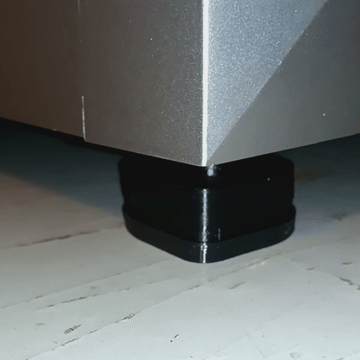

# Plus 4


Bought a Qidi Plus 4 notes on safety, upgrades, and some improvement parts below.    

**Layout** 

  * Index of related sub-sections 
  * Safety Recommendations
  * Addons

<hr>

## Index of SubSections

| Name | Desc | Image | 
| --- | --- | --- | 
| [HULA v1 Unimount Adapter](HULA_Adapter/README.md) | Adapter that fits the HULA unimounts and Plus 4 stock feet |  | 
| [Quick Detach Waste slide (left side)](Waste_Extract/README.md) | Quick detatch slide and mount |  | 
| [Cutting Lever Bumpers](Waste_Extract/README.md) | Bumpers to help quiet the noise from the filament cutter |  | 

## Safety and Recommendations

Recommend you check / update these items before serious use. 

### SSR Board

Early models had some issues with the SSR board, you can read more about it [here](https://github.com/qidi-community/Plus4-Wiki/blob/main/content/heater-ssr-upgrade/README.md) and Qidi details any replacement proceedure on their wiki.

#### TLDR
Your SSR board should have wires in this order. 

|  ) |  | 
| :---: | :---: | 
| Bad | Good |

*not to be confused with* 


|  ) |  | 
| :---: | :---: | 
| Bad | Good |


Additionally the updated config section reduces the PWM for the chamber heater to 40%. Locate the section of your printer config that resembles below and check the line that says max_power

e.g. 

``` 
[heater_generic chamber]
heater_pin:U_1:PC8
max_power:0.4
sensor_type:NTC 100K MGB18-104F39050L32
sensor_pin:U_1:PA1

control = pid
pid_Kp=63.418 
pid_Ki=1.342 
pid_Kd=749.125

min_temp:-100
max_temp:70
```


 
### SSH Password

Change your ssh creds from defaults (below) 

User: mks 

PW: makerbase

## Addons

Optional addons that make life easier

### Spoolman 

I run [Spoolman](https://github.com/Donkie/Spoolman) in a Docker container, yaml and configs below. 

```
services:
  spoolman:
    image: ghcr.io/donkie/spoolman:latest
    restart: unless-stopped
    volumes:
      # Mount the host machine's ./data directory into the container's /home/app/.local/share/spoolman directory
      - type: bind
        source: ./data # This is where the data will be stored locally. Could also be set to for example `source: /home/pi/printer_data/spoolman`.
        target: /home/app/.local/share/spoolman # Do NOT modify this line
    ports:
      # Map the host machine's port 7912 to the container's port 8000
      - "7912:8000"
    environment:
      - TZ=America/New_York # Optional, defaults to UTC

```
Update your Moonraker.conf file and point it toward your server running docker 


e.g. (place at end of file)

```
[spoolman]
server: http://192.168.xxx.xxx:7912
# URL to the Spoolman instance. This parameter must be provided.
sync_rate: 5
# The interval, in seconds, between sync requests with the
# Spoolman server. The default is 5. 
```
