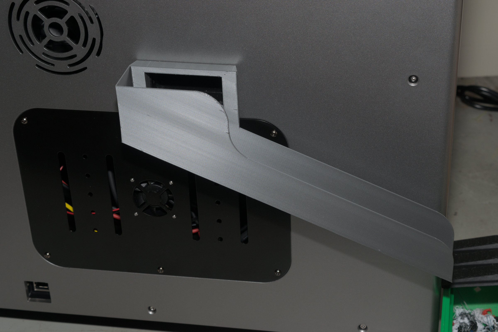
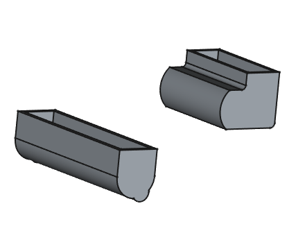

# Waste Extract Upgrades

  * A quick detach waste slide
  * Cutting lever dampners to reduce noise. 

## Waste Slide 

Quick mount detachable waste slide, exits left side. 

|   |  |
| --- | --- |

Attach mounth with stock screws and slode chute over top. 

Shown in Overture Space Gray PETG

## Cutting Lever Bumpers

Covers for the cutting lever to reduce noise

 

Print in TPU and place over ends of cutting lever. 

## Files

  * [Mount](files/Mount.step)
  * [Slide](files/Slide.step)
  * [Bumper1](files/Bumper1.step)
  * [Bumper2](files/Bumper2.step)
