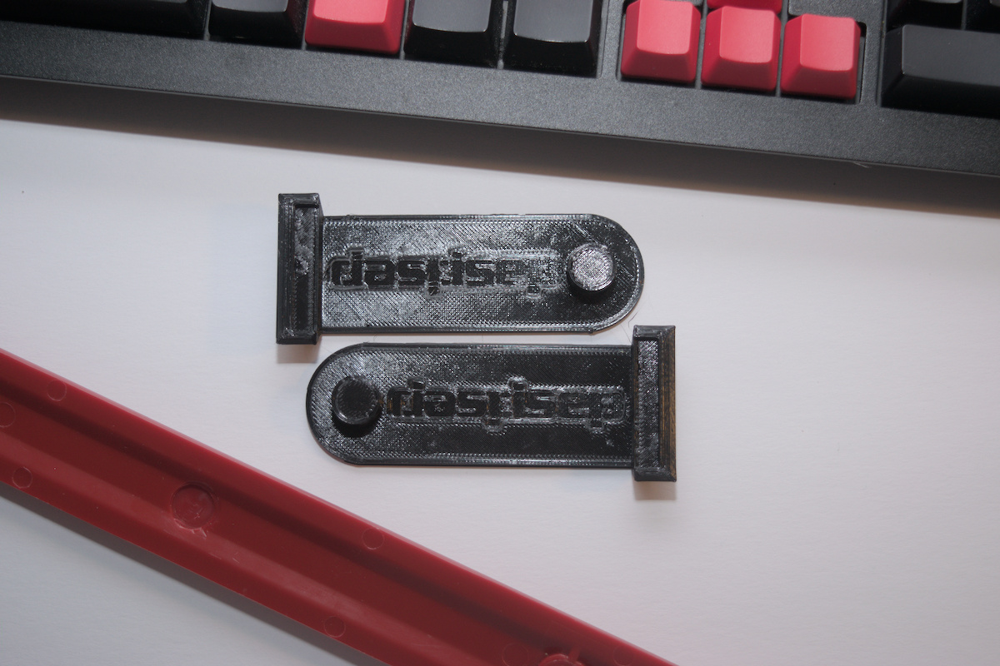

# 

Simple riser to work with select daskeyboard models.  

|  |  |
| --- | --- |

* Retains ruler
* Utilizes existing magnetic retention 
* Works with select keyboard models shown below
* Comes with omnidirection text logo that even the most discerning German engineer should find acceptable

| Stock | Riser |
| --- | --- | 
|  |  | 

## Works with
daskeyboard [ultimate](https://www.daskeyboard.com/daskeyboard-4-ultimate/) or [professional](https://www.daskeyboard.com/daskeyboard-4-professional/) 

 

## Print

Print in material of choice and assemble with 8x2 mm magnets. 

Use two or three magnets depending on strength. (middle spacer optional)

### Files 
* [riser](print/riser.stl) 
* [spacer](print/spacer.stl)

